# Seminario servicios REST ~ José Santos Salvador

Tal y como te comentamos durante el seminario, siguiendo los mismos pasos y verificando que estuviese JDK 1.8, no me funcionaba. El error que me da es 

    Deployment error: Starting of Tomcat failed, the server port 8080 is already in use.

El Tomcat me funciona de forma correcta

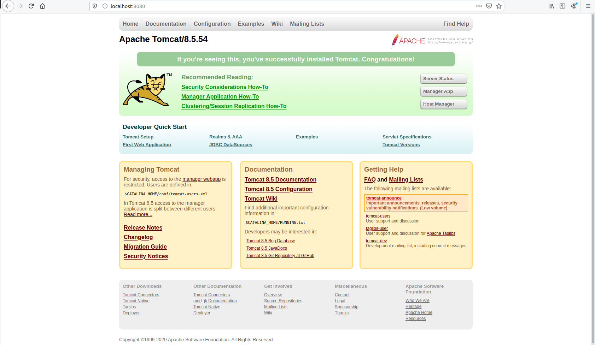

Pero el hacer deploy, me lanza ese error  y si escribo en el navegador 

    localhost:8080/SeminarioRest

no me muestra nada y me lanza un mensaje de error

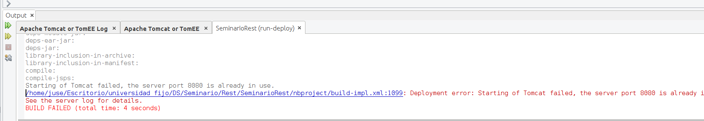  
  
 

   
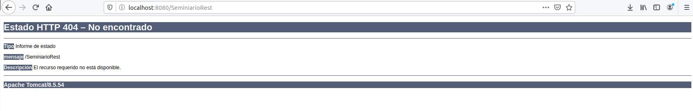

He de decir también que he intentando usar eclipse siguiendo el tutorial que me pasaste, sin embargo no me salía si quiera lo de dynamic web project. Estuve buscando y necestaba instalar un par de cosas pero al realizarlo, me daba un error [1]. Creo que puede ser porque tengo la versión 2019 de Eclipse.  
Tras todas estas pruebas, desistí y me vi el video y el pdf para entenderlo todo.   

Como último recurso probe con window 10 y me funcionaba con netbeans 8.2, siguiendo el mismo proceso. Adjunto captura funcionando

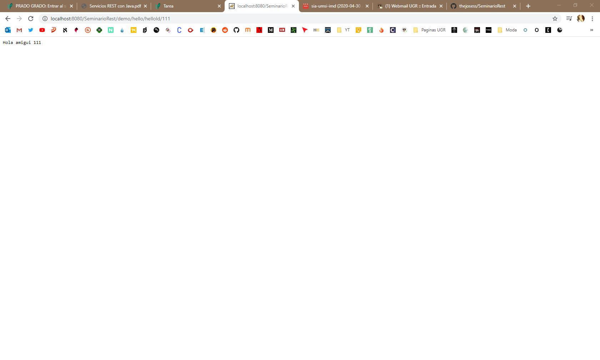

http://localhost:8080/SeminarioRest/demo/hello
(demo está configurado en el web.xml) y hello está definido en

    @Path("hello")

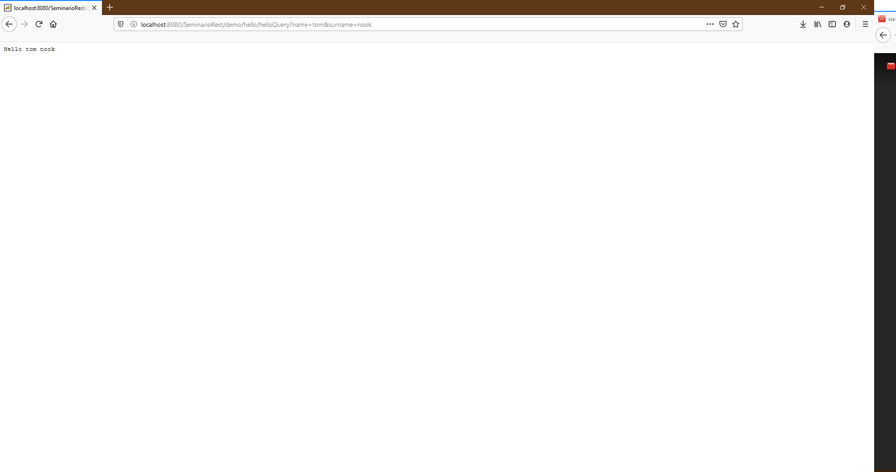

Para la parte de JSON es necesario en la clase MyDate poner

    @XmlRootElement

para decirle que es JSON o XML, se realiza un JSON de una instancia de MyDate

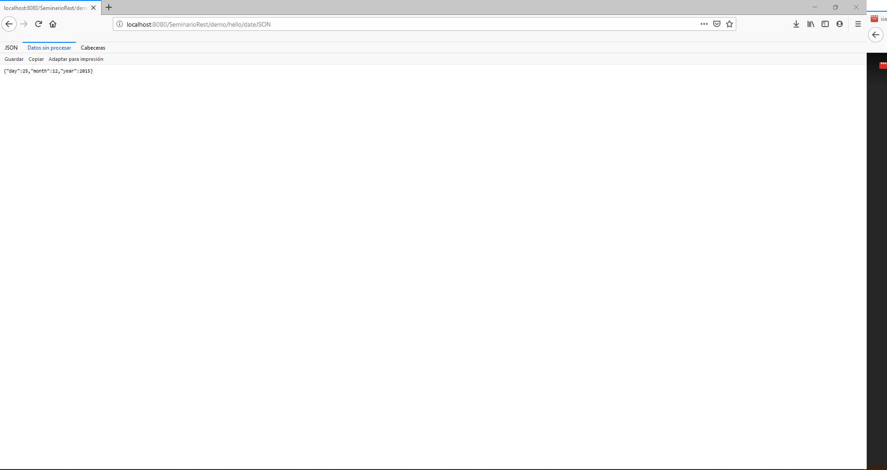

En la siguiente parte se simula un Cliente con el uso de una extensión de Chrome llamada Advance Rest Client. Si usaramos el navegador, nos daría un error ya que es una petición GET y myDateForm es una petición POST y para eso se usa la extesión de Chrome

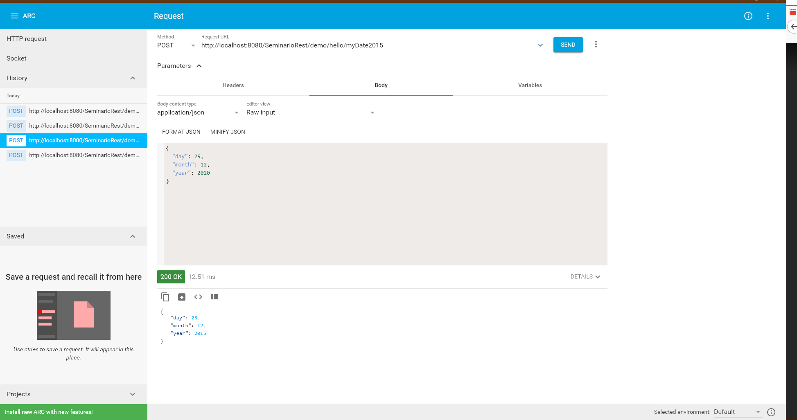

Tambien hice la petición POST con un formulario desde html, cambiando el código html para tener mi path correcto.

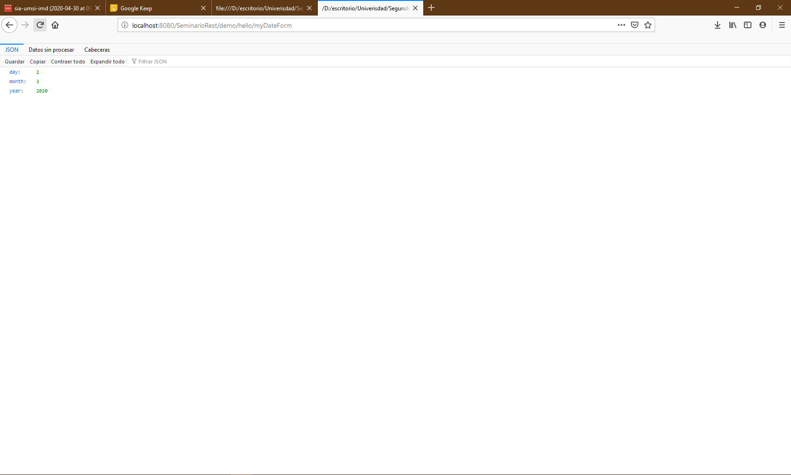

Despues hice peticiones PUT

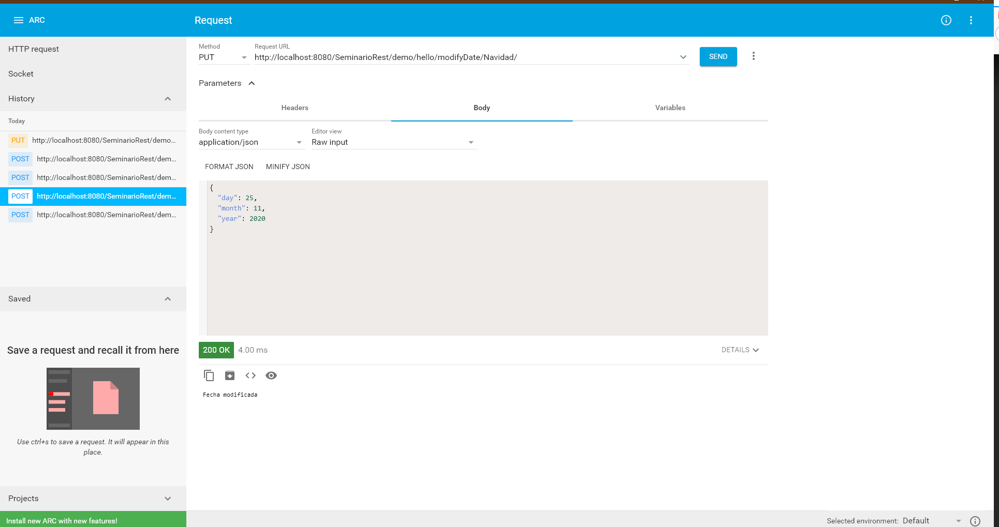

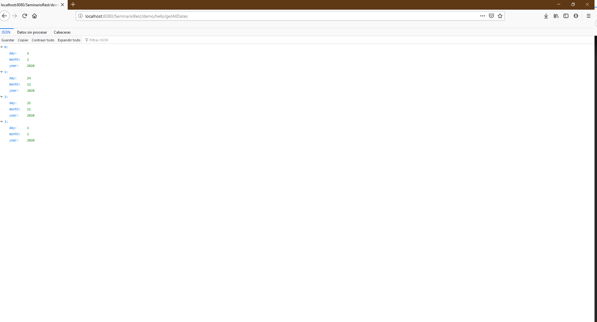

Usando Clienta también

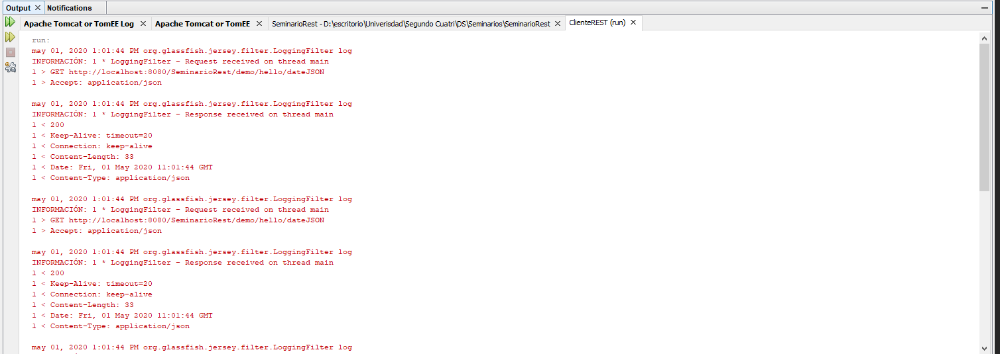

[1]: https://beginnersbook.com/2017/06/how-to-fix-dynamic-web-project-missing-in-eclipse-issue/

